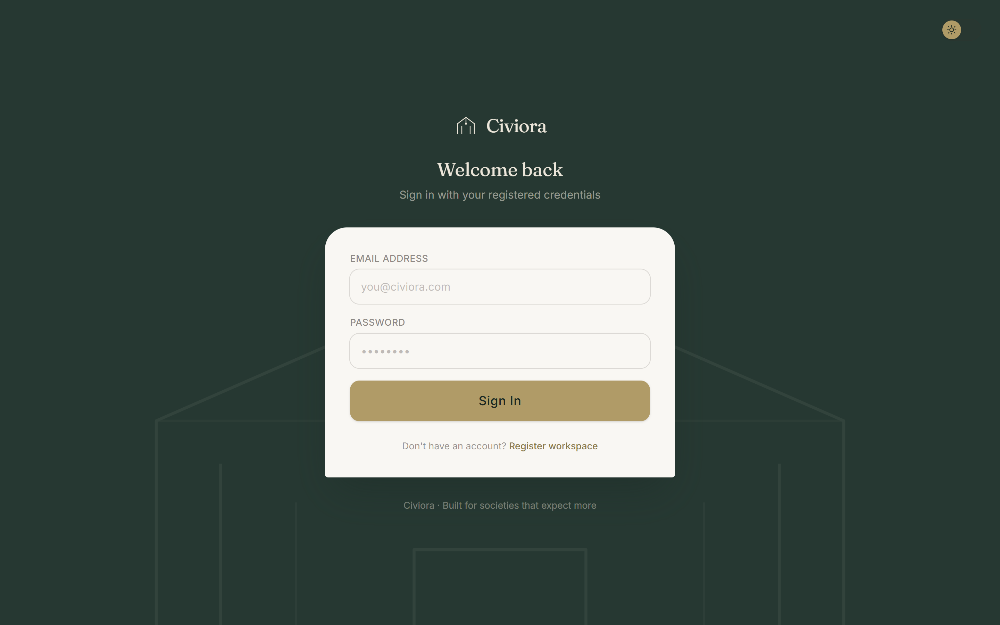
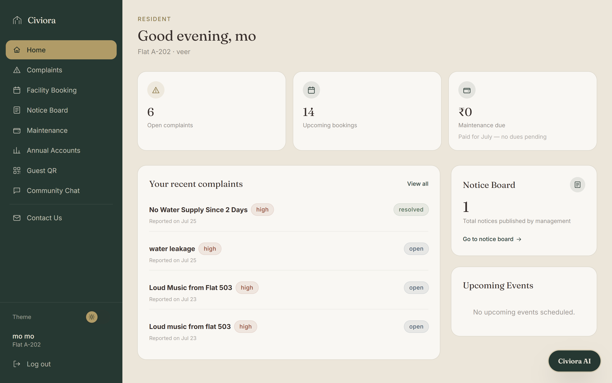
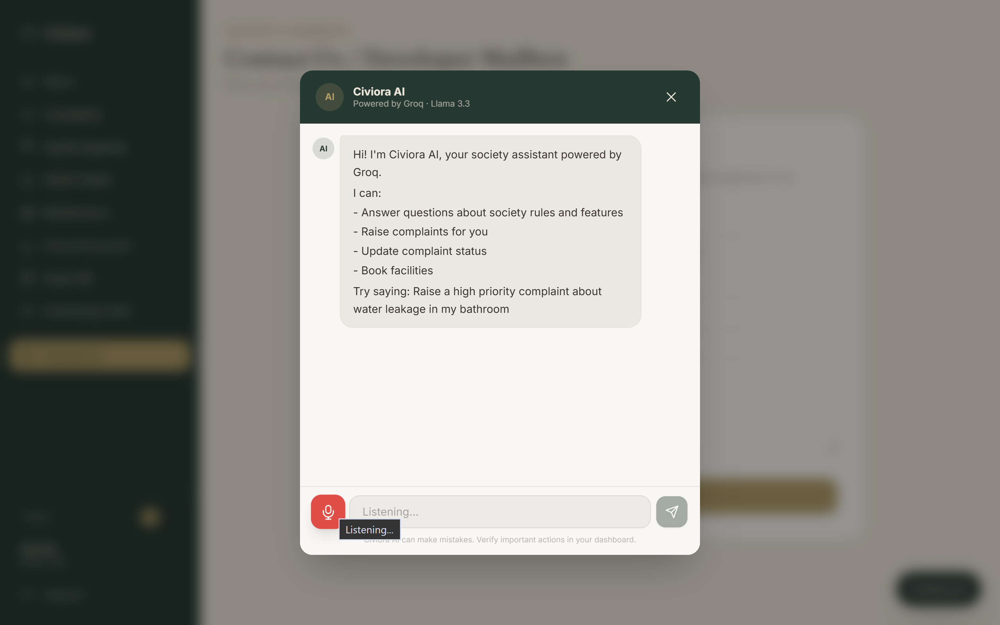

# 🏡 Civiora Frontend

Civiora is an AI-powered smart society management platform designed to simplify day-to-day operations of residential communities. While premium society management solutions are often limited to luxury townships, Civiora aims to democratize this technology by making it accessible, affordable, and user-friendly for societies of all sizes.

This repository contains the **frontend** of the Civiora application, built using **React**, **Vite**, and **Tailwind CSS**, providing a fast, responsive, and modern user interface.

---

# 🚀 Features

- 🔐 Secure Authentication
- 🤖 AI-powered Society Assistant
- 💳 Online Maintenance Payment
- 📄 Instant Digital Payment Receipts
- 📢 Society Notice Board
- 🏢 Facility Booking System
  - Clubhouse
  - Party Hall
  - Gym
  - Swimming Pool
  - Sports Courts
- 📱 QR Code Generation & Scanning
- 🛠 Complaint Management
- 💬 Community Chat (Wing-wise & Group-wise)
- 📱 Fully Responsive UI
- ⚡ Fast navigation with React Router

---

# 🚀 Tech Stack


---

# 📂 Project Structure

```
frontend
│
├── public/
├── src/
│   ├── assets/
│   ├── components/
│   ├── pages/
│   ├── context/
│   ├── hooks/
│   ├── utils/
│   └── App.jsx
│
├── package.json
├── vite.config.js
└── README.md
```

---

# 📸 Application Screenshots

## Landing Page


## Login Page



## Dashboard



## AI Assistant



Facility Booking

QR Code

Notices

Chats

Contact US

Annual Accounts

Payments

Complaints


---

# 🛠 Installation

Clone the repository

```bash
git clone <repository-url>
```

Navigate to the frontend directory

```bash
cd frontend
```

Install dependencies

```bash
npm install
```

Start the development server

```bash
npm run dev
```

The application will run at:

```
http://localhost:5173
```

---

# 📜 Available Scripts

| Command | Description |
|----------|-------------|
| npm run dev | Starts development server |
| npm run build | Builds the production version |
| npm run preview | Preview production build |
| npm run lint | Run ESLint |

---

# 📦 Major Dependencies

- React
- React Router DOM
- Tailwind CSS
- Axios
- HTML5 QRCode
- QRCode
- React Icons
- Framer Motion (if used)

---

# 🎯 Vision

Civiora aims to bridge the technological gap between premium gated communities and ordinary residential societies. By integrating Artificial Intelligence with intuitive digital tools, the platform streamlines maintenance management, facility booking, complaint resolution, communication, and payments into one seamless experience.

---

# 🔮 Future Enhancements

- 🔔 Push Notifications
- 📊 Society Analytics Dashboard
- 💬 AI Voice Assistant
- 📹 Visitor Face Recognition
- 📅 Smart Event Management
- 📈 Maintenance Defaulter Analytics
- 🏠 Multi-Society Support
- 📱 Mobile Application

---

# 👨‍💻 Developed By

**Binary Architects**

National Hackathon Project

---
